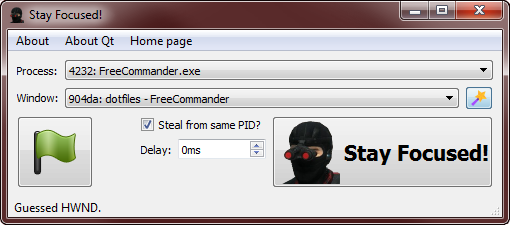
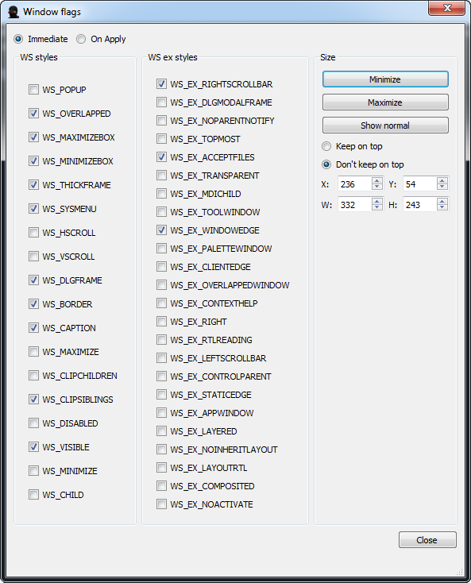

# Stay Focused!

Program that keeps selected Windows window focused.

This program lists all processes in Windows in a combo box. When one
of the processes is selected, all windows of that program are listed
and inserted into another combo box. Program can also guess last
active window with a press of the magic wand button.

When a window is selected and big "Stay Focused!" button is pushed,
the program will hook into Windows events and reactivate selected
window if that window stops being the foreground window.

Please note that program sleeps when its own window is selected. To
start focusing, you need to activate a window of a different program.

## Window flags

Stay Focused! also allows to manipulate style flags of windows.

# Home Page

https://github.com/Zalewa/StayFocused
